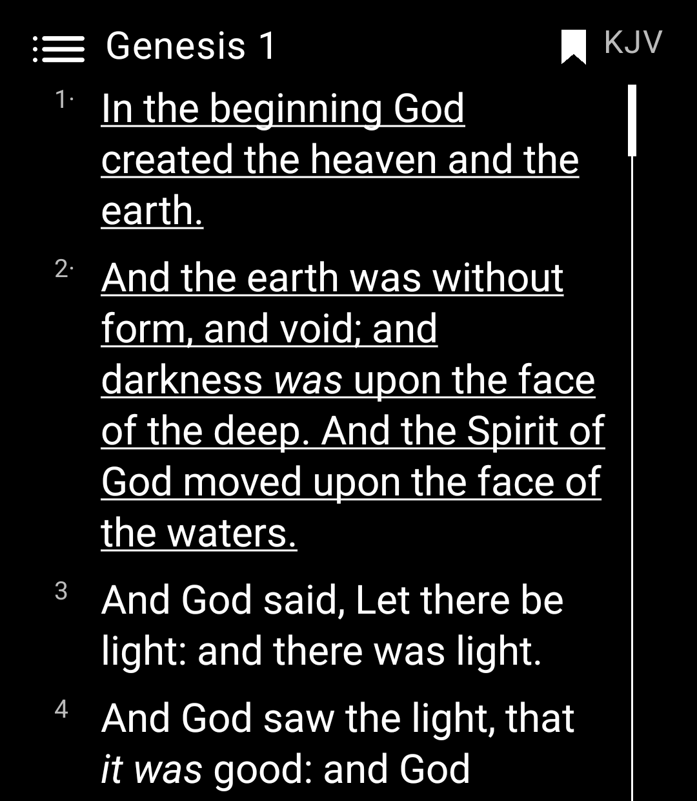
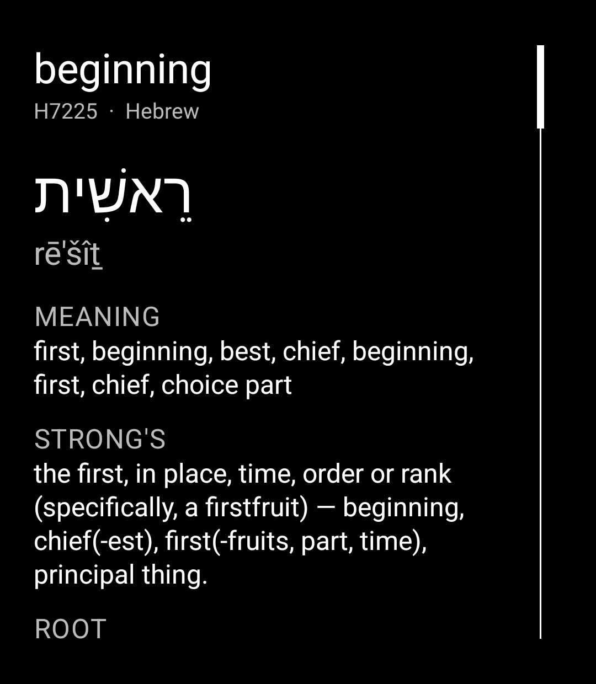
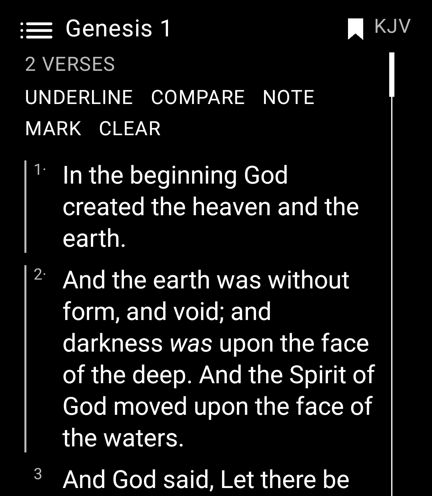
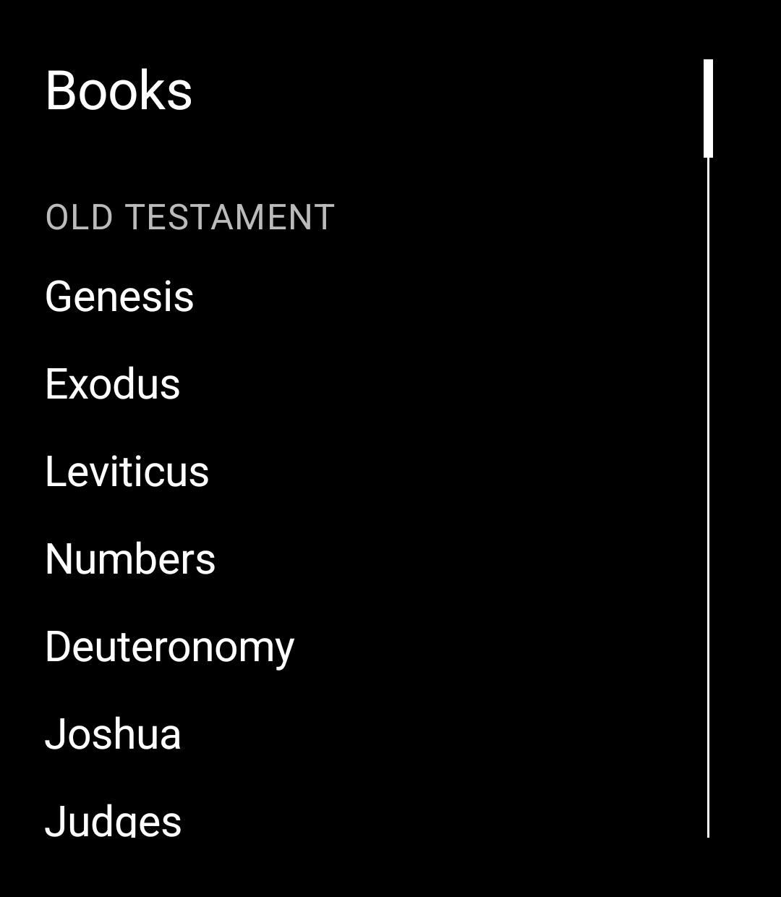
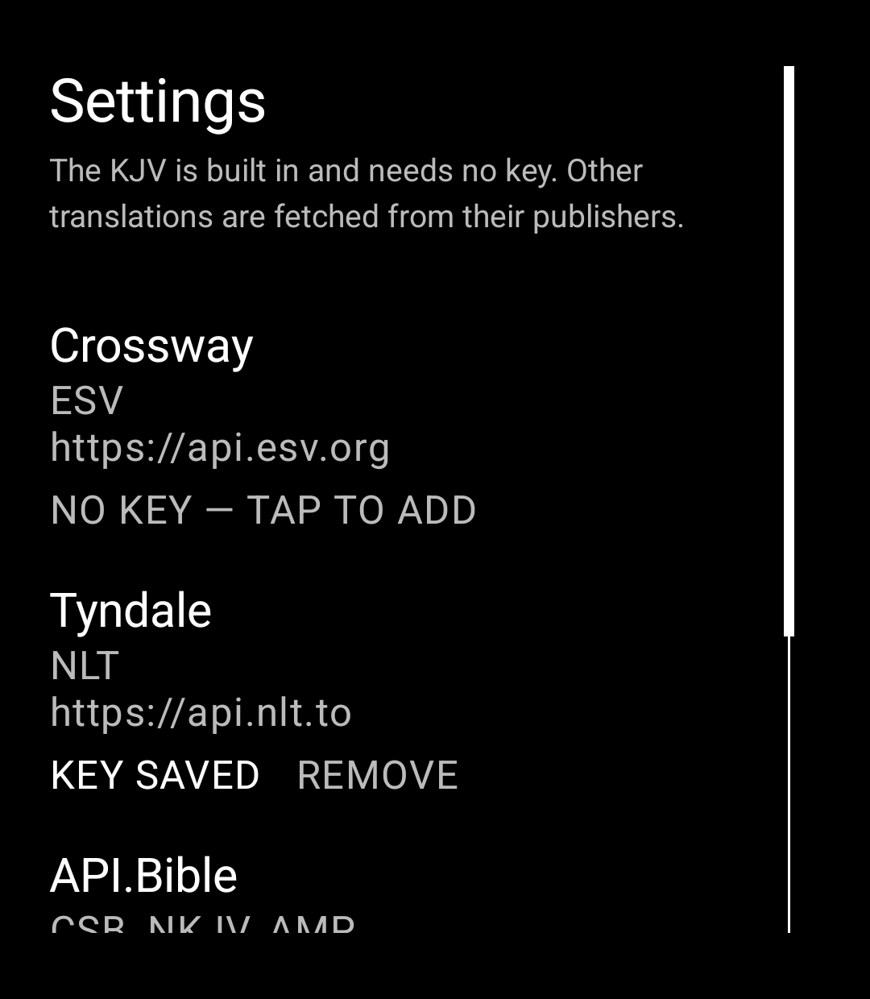

# Word of Light

A minimalist Bible reader for the [Light Phone III](https://www.thelightphone.com/), built
as a Light SDK tool. Black and white, no notifications, no feed — just Scripture, with a
word study one long-press away.

The King James Version ships inside the app: all 66 books, 31,102 verses, tagged with
Strong's numbers, with the full Hebrew and Greek lexicon and a complete concordance. It
works with the radio off. No account, no key, no network.

| Reading | Word study | Selection |
|---|---|---|
|  |  |  |

| Books | Settings |
|---|---|
|  |  |

---

## Features

### Reading

- **The whole KJV offline.** 66 books, 31,102 verses bundled in the app.
- **Book and chapter picker** — tap the chapter title at the top left.
- **Chapter navigation that names its destination.** The bottom of Genesis 1 offers
  "Genesis 2", not "NEXT". At the end of a book it tells you which book comes next.
- **Turning the page starts at the top** of the new chapter.
- **Translator-added words in italics** — the words the KJV translators supplied that have
  no counterpart in the Hebrew or Greek, printed in italics since 1611.
- **Dark by default**, with a light theme in Settings.

### Word study

Long-press any word to open it.

- The **Hebrew or Greek** original, its transliteration, and its meaning.
- The **Strong's number**, definition, root and part of speech.
- **"Found X verses"** — every other verse in the Bible using that same original word.
  Tap one to jump there.
- **Testament-aware.** The Old Testament is Hebrew and Aramaic, the New is Greek. A word
  tagged with a number from the wrong language shows nothing rather than a wrong answer —
  a mistaken lexicon entry looks completely authoritative, which is worse than a blank.

Backed by 326,681 tagged words, a 12,040-entry lexicon (4,760 Greek, 7,280 Hebrew) and a
concordance of 291,919 verse references. All of it on the device.

### Saving

- **Tap a verse to select it**, keep tapping to add more, then act on the whole selection.
- **Highlight**, **bookmark**, and **note** — all stored on the phone and kept across
  restarts.
- Because the screen is monochrome, state shows as a bar in the left margin: bright for a
  highlight, dim for a pending selection. A `*` on the verse number marks a bookmark, a
  `·` marks a note.
- **SAVED** lists everything you have kept, in canonical order, grouped into notes,
  highlights and bookmarks. Tap any entry to jump to it.

Nothing is uploaded anywhere. There is no account and no sync.

---

## Translations

The KJV is built in because it is public domain. Everything else is copyrighted and comes
from its publisher's own API, using **your** key — the text goes from the publisher to your
phone, and never through this project.

| Version | Source | Cost |
|---|---|---|
| **KJV** | Bundled in the app | Free, offline, no key |
| **ESV** | Crossway, `api.esv.org` | Free for non-commercial use |
| **NLT** | Tyndale, `api.nlt.to` | Free for non-commercial use |
| **CSB, NKJV, AMP** | API.Bible (American Bible Society) | Free Starter tier — pick any 3 |

**Three signups, not five.** Crossway and Tyndale each run their own API for their own
translation. One API.Bible account covers CSB, NKJV and AMP together, because its free
Starter tier grants three copyrighted translations.

> **Status:** key storage and Settings are built and working. The fetch layer is not
> finished yet, so entering a key stores it but does not yet download text. The KJV is
> fully functional.

---

## Getting your API keys

### API.Bible — unlocks CSB, NKJV and AMP

One key covers all three.

1. Go to **[docs.api.bible](https://docs.api.bible/)** and follow the link to the developer
   portal. Note that American Bible Society replaced the older `scripture.api.bible` portal
   during 2026 — older tutorials point at a host that no longer exists.
2. Create an account.
3. Create an **application**. You will be asked what you are building.
4. On the free **Starter** plan you select **three** copyrighted translations. Choose
   **CSB**, **NKJV** and **AMP**.
5. Copy the key from your application's page.

Free tier: 5,000 calls per month across all three, non-commercial use.

### ESV — Crossway

The step people miss: **creating an account does not give you a key.** You must create an
*Application*, and it may wait on manual approval by Crossway staff.

1. Go to **[api.esv.org](https://api.esv.org/)** — this is a different site from
   `crossway.org`.
2. Click the avatar → **Sign In**, creating the account there if you need one.
3. Click **Create an API Application**
   ([direct link](https://api.esv.org/account/create-application/)).
4. Describe your application honestly. **This is the step that may need staff approval**,
   which is why no key appears immediately.
5. Once approved, the key is issued.
6. To find it again later: avatar → **My API Applications**.

Free tier: 5,000 requests per day, non-commercial use.

### NLT — Tyndale

1. Go to **[api.nlt.to](https://api.nlt.to/)**.
2. Register for a key.

Free for non-commercial use.

---

## Entering a key in the app

1. Scroll to the bottom of any chapter.
2. Tap **SETTINGS**.
3. Tap the provider you have a key for — **Crossway**, **Tyndale** or **API.Bible**. Each
   row lists which translations it unlocks and where to get the key.
4. Type the key on the Light Phone keyboard and tap **SAVE**.
5. The row changes to **KEY SAVED**. Tap **REMOVE** to delete it.

Once a key is stored, switch translations by tapping the version abbreviation at the top
right of the reader.

### How your keys are stored

- Keys are **typed on the device**. Nothing is compiled into the app.
- They are encrypted with **AES-256/GCM** under a key held in the **Android Keystore**,
  which is hardware-backed and cannot be exported from the phone.
- **A saved key is never displayed back.** Settings shows only whether one is present, and
  editing always opens an empty field, so a key can be replaced but not read off the
  screen.
- Keys never leave the device except as a header on a request to that provider.

Installing a **newer APK over an older one keeps everything** - keys, notes, highlights,
bookmarks and recents. Android replaces the code and leaves the app's data directory
alone, so long as the package name and the signing key both stay the same.

What does lose your keys is an actual **uninstall**, "Clear data", a factory reset, or a
restore onto a different phone - the Keystore key is bound to the device and cannot
travel with a backup. Settings will show "NO KEY" again and you retype it. That is the
correct trade for a credential, not a fault.

> **Changing the signing key counts as an uninstall.** Android refuses an update signed
> with a different key, so switching keystores means uninstalling first and losing notes
> and keys with it. Settle on a keystore before you write anything you would miss.

---

## Building

Requires the Android SDK and a JDK.

```bash
./gradlew :tool:assembleDebug
```

On Windows with Android Studio's bundled JDK:

```bash
JAVA_HOME="F:\Android Studio\jbr" ./gradlew.bat :tool:assembleDebug
```

Install to the LightPhone3 emulator:

```bash
adb -s emulator-5554 install -r tool/build/outputs/apk/debug/tool-debug.apk
```

Launch it:

```bash
adb -s emulator-5554 shell monkey -p com.outofthewhale.wordoflight -c android.intent.category.LAUNCHER 1
```

Run the tests:

```bash
./gradlew :tool:testDebugUnitTest
```

### Signing

Release builds look for `local/keystore.properties`, which is outside version control:

```properties
storeFile=wordoflight-release.jks
storePassword=...
keyAlias=wordoflight
keyPassword=...
```

Create one with:

```bash
keytool -genkeypair -keystore local/wordoflight-release.jks -alias wordoflight   -keyalg RSA -keysize 4096 -validity 10000
```

Without that file the build still works, falling back to the Light SDK's shared dev key
(LP3) or the Android debug key (LP2). Those builds are fine for your own phone and must
never be handed to anyone else: both keys are public, so anyone can forge an "update" to
an app signed with them. **Back the keystore and its password up.** Lose either and you
can never update an already-installed copy again.

> **Note on sideloading:** Light SDK tools do not yet appear in the LightOS launcher on
> real Light Phone III hardware. This is an upstream gap, not a bug in this app — Light's
> own SDK README says shipping LightOS builds are not yet ready for tools built this way,
> and ADB sideloading is the interim path. Launch on-device with the `monkey` command
> above until Light ships launcher support.

---

## Project layout

```
tool/src/main/kotlin/com/outofthewhale/wordoflight/
  Canon.kt              66 books, chapter counts, testaments
  Models.kt             verses, modules, translations
  ModuleStore.kt        loads books from device storage, then bundled assets
  Tagging.kt            parses inline Strong's markers and italics
  Lexicon.kt            Strong's dictionary lookup
  Concordance.kt        Strong's number to verse references
  Marks.kt              highlights, bookmarks and notes
  KeyCipher.kt          AES-256/GCM key encryption
  ApiKeyStore.kt        encrypted API key storage
  ReaderScreen.kt       the reader
  WordStudyScreen.kt    original language and occurrences
  BookSelectScreen.kt   book picker
  ChapterSelectScreen.kt
  VersionSelectScreen.kt
  MarksScreen.kt        saved highlights, bookmarks and notes
  SettingsScreen.kt     API keys and theme
  NoteEditScreen.kt     text entry

tool/src/main/assets/
  bible/kjv/            66 books, tagged  (9.0 MB)
  lexicon/              Strong's, bucketed (4.7 MB)
  concordance/          reverse index      (3.6 MB)

tools/import/
  fetch_kjv_tagged.py   downloads and converts the tagged KJV and lexicon
  build_concordance.py  builds the reverse index from the imported text
  bible_import.py       converts pasted chapter text into modules
  test_bible_import.py
```

### Regenerating the bundled data

The assets are committed so the app builds offline, but they are reproducible:

```bash
cd tools/import
python fetch_kjv_tagged.py --assets ../../tool/src/main/assets
python build_concordance.py --assets ../../tool/src/main/assets
```

Both scripts validate what they produce — verse totals against the KJV's known 31,102,
per-book chapter and verse contiguity, and that no Old Testament word carries a Greek tag
or vice versa.

---

## Attribution

- **King James Version** (1611) — public domain.
- **Strong's Exhaustive Concordance** (James Strong, 1890) — public domain. Lexicon data
  derived from the [Open Scriptures](https://github.com/openscriptures/strongs) edition.
- Tagged KJV text from [kaiserlik/kjv](https://github.com/kaiserlik/kjv).
- Built on the [Light SDK](https://github.com/lightphone/light-sdk).

No copyrighted translation is included in this repository or in the built app. ESV, NLT,
CSB, NKJV and AMP are retrieved at runtime from their publishers using the reader's own API
key, under whatever terms that reader agreed to when they signed up.

---

## Status

Working and verified on the LightPhone3 emulator:

- Reading, book and chapter navigation, version picker
- Strong's word study and concordance lookup
- Highlights, bookmarks and notes, persisted across restarts
- Settings and encrypted API key storage

Not built yet:

- Fetching text from the publisher APIs (keys are stored but unused)
- Verse comparison across translations
- Full-text search
- Resume where you left off
- Audio Bible
- Chapter-level notes (supported in the data model, no screen yet)
